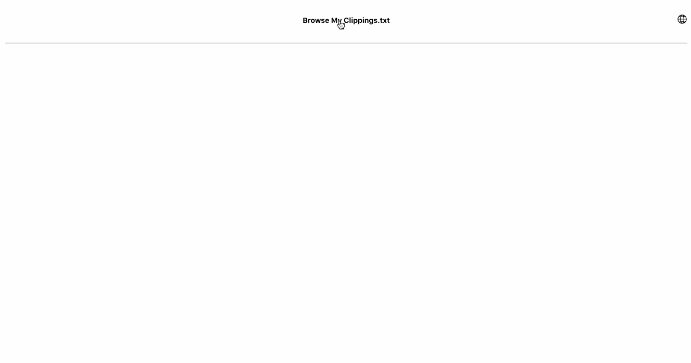

  

<h1 align="center">My Clippings</h1>

---

整理 Kindle 标注、书签和笔记从未如此简单！

## 🧐 介绍 

上传 *My Clippings.txt*，按照书名整理 Kindle 标注、书签和笔记的 Chrome 扩展。

## 🏁 安装 

## ⛏️ 技术栈 

- Create-React-App
- React.js
- Lodash
- Typescript

## Feature

- [x] 解析笔记
- [x] 解析书签
- [x] 解决标注
- [ ] 单词本
- [ ] 多语言

## License
